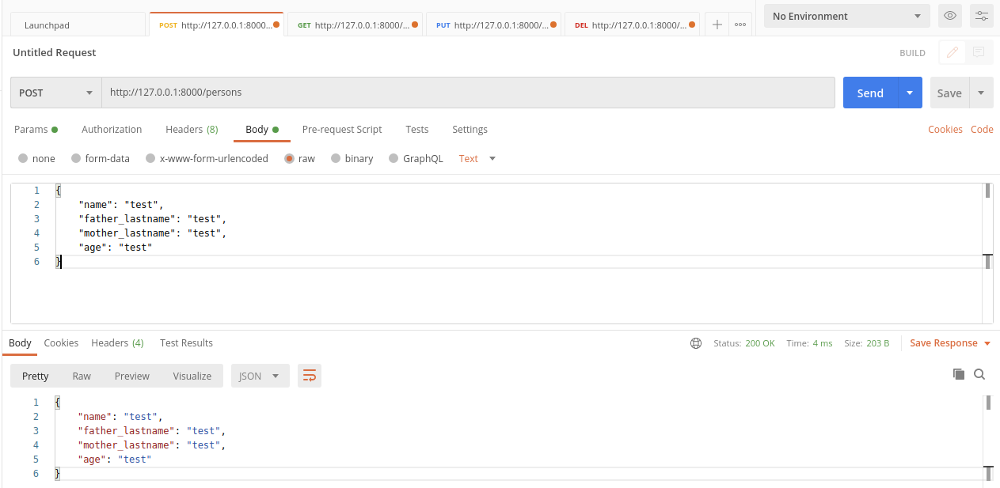

# FlaskProject
Micro project for Flask API

Requirements


```
    $ pip install -r requirements
```


```
    sqlite3
```

Instalation
```
    $ sqlite3 databases/store.db
    >> .databases
    >> .exit
```

Execution
```
    $ uvicorn app:app --reload
```

Format to send data

```
    {
        "name": "test",
        "father_lastname": "test",
        "mother_lastname": "test",
        "age": "test"
    }
```

